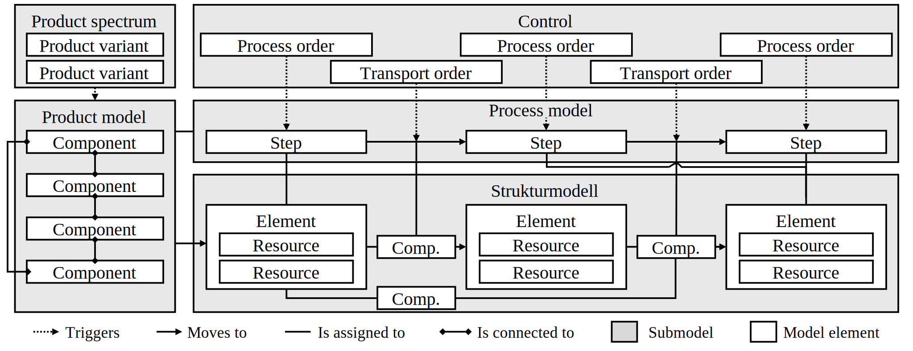

# Flexible Disassembly Simulation Tool

> **⚠️ Note**
> The associated research article for this repository is currently under review. Information such as DOI, citation format, and license will be updated after the article is published.


A SimPy-based discrete event simulation framework for modeling and analyzing disassembly scenarios with configurable disassembly systems, product portfolios and material flow strategies.

> **🔬 Research Software Notice**
>
> This is a **research prototype** (v2025-09) developed for academic purposes. It has been verified through 17 validation and verification scenarios (11 verification and six validation experiments). See [`docs/experiments_overview.md`](docs/experiments_overview.md) for the specific experimental design and validation results. This repository provides supplementary materials to facilitate the practical application and reproduction of the simulation framework described in the associated scientific publication. This documentation is intended to provide users with implementation guidance and technical information. While some documents include scientific references, these are solely intended to provide contextual understanding and sources for further reading. The peer-reviewed scientific contribution can only be found in the published article. For an overview of the scientific outcomes and contributions, please refer to the publication.

## Table of Contents
- [Contact](#contact)
- [1. Introduction](#1-introduction)
  - [1.1 Framework Documentation](#11-framework-documentation)
  - [1.2 Related Research Work and Repositories](#12-related-research-work-and-repositories)
  - [1.3 Research Context](#13-research-context)
- [2. Installation](#2-installation)
- [3. System Architecture](#3-system-architecture)
- [4. Documentation](#4-documentation)
- [5. Usage Instructions](#5-usage-instructions)
  - [5.1 Quick Start](#51-quick-start)
  - [5.2 Basic Commands](#52-basic-commands)
  - [5.3 Command Options](#53-command-options)
  - [5.4 Usage Examples](#54-usage-examples)
- [6. Experiments Overview](#6-experiments-overview)
  - [6.1 Verification Experiments](#61-verification-experiments)
  - [6.2 Validation Experiments](#62-validation-experiments)
- [7. Configuration Hiearchy](#7-configuration-hierarchy)
- [8. Output Files](#8-output-files)
  - [8.1 Core Outputs](#81-core-outputs)
  - [8.2 Additional Outputs](#82-additional-outputs)
  - [8.3 Output Configuration](#83-output-configuration)
- [9. Project Structure](#9-project-structure)
- [Citation](#citation)
- [License](#license)
- [References](#references)


## Contact
### Contact Details
Corresponding author: Patrick Jordan  
Institutional email: patrick.jordan@iwb.tum.de  
Personal profile: [patrick-jordan.github.io](https://patrick-jordan.github.io/)


### Useful Links
- **[Visit our other repositories](https://iwb.github.io)**  
Explore more tools and resources from our research institute.

- **[Visit our institute for more information](https://www.mec.ed.tum.de/en/iwb/homepage/)**  
Learn more about our research and ongoing projects.

- **[Vist the official TUM GitHub organization](https://github.com/tum)**  
Discover more open-source research projects from the Technical University of Munich (TUM).


<!-- ================================================== -->
<!-- INTRODUCTION SECTION -->
<!-- ================================================== -->
## 1. Introduction

This simulation tool provides a flexible framework for modeling disassembly scenarios. Each **disassembly scenario** is defined by a distinct **system design scenario** (i.e., layout and workstation configurations) and a **product scenario** (i.e., incoming products and disassembly depths). As the decisions related to these scenarios are interdependent, there are multiple disassembly scenarios that are possible. According to [Jordan et al. (2024)](#jordan-et-al-2024), a comparison of these scenarios is necessary to determine the economically and ecologically appropriate disassembly scenario. The developed model supports settings such as:
- system layout types (workshop, linear, parallel, and split-flow configurations),
- material flow modes (push and pull strategies),
- quality-based routing (component condition affects processing decisions),
- process mining outputs (case table and event logs compatible for process mining-based analysis), and
- stochastic modeling (equipment breakdowns, variable processing times, and quality variations of products and components).


### 1.1 Framework Documentation

Table 1.1 provides an overview of the framework documentation.

<br>

**Table 1.1.** Framework documentation overview

<table>
  <thead>
    <tr>
      <th width="30%">Document</th>
      <th width="70%">Content</th>
    </tr>
  </thead>
  <tbody>
    <tr>
      <td><a href="docs/configuration_guide.md">configuration_guide.md</a></td>
      <td>Guide to configuring experiments, systems, and products</td>
    </tr>
    <tr>
      <td><a href="docs/experiments_overview.md">experiments_overview.md</a></td>
      <td>All 17 verification and validation experiments</td>
    </tr>
    <tr>
      <td><a href="docs/parameter_reference.md">parameter_reference.md</a></td>
      <td>Reference for all 50 simulation parameters with implementation status</td>
    </tr>
    <tr>
      <td><a href="docs/limitations.md">limitations.md</a></td>
      <td>Known limitations, implementation status, and future extensions</td>
    </tr>
  </tbody>
</table>

<br>

### 1.2 Related Research Work and Repositories

Table 1.2 provides an overview of the related research work and repositories that are part of this research project.

<br>

**Table 1.2.** Related research work and repositories

<table>
  <thead>
    <tr>
      <th width="15%">Resource</th>
      <th width="45%">Purpose</th>
      <th width="20%">Repository</th>
      <th width="20%">Publication</th>
    </tr>
  </thead>
  <tbody>
    <tr>
      <td>Concept paper</td>
      <td>Provides the foundational concepts for data-based decision support in tactical disassembly planning, establishing the theoretical framework for comparing disassembly scenarios</td>
      <td>—</td>
      <td><a href="https://doi.org/10.1016/j.procir.2024.01.042">Jordan et al. (2024)</a></td>
    </tr>
    <tr>
      <td>Disassembly factors</td>
      <td>Identifies and categorizes the relevant factors that influence disassembly operations, forming the basis for what parameters the simulation model must represent</td>
      <td>—</td>
      <td><a href="https://doi.org/10.1007/978-3-031-86893-1_62">Jordan et al. (2025a)</a></td>
    </tr>
    <tr>
      <td>Simulation model</td>
      <td>Generates synthetic event data for disassembly scenarios, enabling the exploration of different system configurations and product portfolios</td>
      <td>(this repository)</td>
      <td>TBA<sup>†</sup></td>
    </tr>
    <tr>
      <td>Learning factory dataset</td>
      <td>Provides empirical disassembly data collected from a physical demonstrator at TU Munich, used for the validation of the simulation model</td>
      <td><a href="https://github.com/iwb/ce-disassembly-lf-dataset">ce-disassembly-lf-dataset</a></td>
      <td><a href="https://doi.org/10.1016/j.procir.2025.03.040">Jordan et al. (2025b)</a><sup>‡</sup></td>
    </tr>
    <tr>
      <td>Data analysis</td>
      <td>Analyzes the simulation output data to evaluate economic and ecological performance of disassembly scenarios using process mining techniques</td>
      <td><a href="https://github.com/iwb/ce-dascen-analysis">ce-dascen-analysis</a></td>
      <td>TBA<sup>†</sup></td>
    </tr>
    <tr>
      <td>Indicator selection tool</td>
      <td>Provides a structured methodology and tools for selecting and balancing economic and ecological indicators across manufacturing systems, applied in this project to the disassembly analysis</td>
      <td><a href="https://github.com/iwb/sus-kpi-sel">sus-kpi-sel</a></td>
      <td><a href="https://doi.org/10.1016/j.procir.2025.04.001">Jordan et al. (2025c)</a></td>
    </tr>
    <tr>
      <td>OCEL visualization</td>
      <td>Enables the advanced visualization of material flows using object-centric event logs (OCEL), requiring the conversion of the simulation output (traditional event logs) to the OCEL format</td>
      <td><a href="https://github.com/iwb/ce-ocel-material-flow-analysis">ce-ocel-material-flow-analysis</a></td>
      <td><a href="https://doi.org/10.1016/j.procir.2025.03.019">Jordan et al. (2025d)</a></td>
    </tr>
    <tr>
      <td>Control strategy simulation</td>
      <td>Compares advanced material flow control strategies (beyond basic push/pull) in simplified disassembly systems and provides insights into appropriate simulation model adjustments/extensions related to material flow logic</td>
      <td><a href="https://github.com/iwb/ce-damfc-simulation">ce-damfc-simulation</a></td>
      <td>TBA<sup>†</sup></td>
    </tr>
  </tbody>
</table>

> **⚠️ Note:** <sup>†</sup> Details will be updated after publication. <sup>‡</sup> The demonstrator described in this publication was used to gather the dataset.

<br>

### 1.3 Research Context

This discrete-event simulation framework is motivated by the work of [Jordan et al. (2024)](#jordan-et-al-2024) and developed to support the data-driven decision-making in tactical disassembly planning. The simulation model enables the exploration of different disassembly scenarios by generating synthetic data for various combinations of disassembly systems and product portfolios, with varying disassembly depths.

The tool was designed in parallel to the development of a physical demonstrator that enables the gathering of data about various disassembly scenarios in a learning factory. To get more information about the demonstrator, please refer to [Jordan et al. (2024)](#jordan-et-al-2024). The gathered validation dataset, using this demonstrator, is available at: [ce-disassembly-lf-dataset](https://github.com/iwb/ce-disassembly-lf-dataset).


The simulation can be used to create a data basis for the comparison of disassembly decisions related to:
- workstation configurations (manual vs. automated processing),
- layout configurations (number of workstations, material flow strategies), and
- changes in the product portfolio (incoming product mix, desired and mandatory disassembly depths).


<!-- ================================================== -->
<!-- INSTALLATION SECTION -->
<!-- ================================================== -->
## 2. Installation
Requires Python 3.10+. Install dependencies with:
```bash
pip install -r requirements.txt
```


<!-- ================================================== -->
<!-- SYSTEM ARCHITECTURE -->
<!-- ================================================== -->
## 3. System Architecture

The framework implements a discrete event simulation (DES) model for disassembly systems. The conceptual model (Figure 3.1) abstracts the system into four interconnected sub-models:
- the product spectrum, defining product variants and their component structures,
- the process model, representing sequential disassembly steps assigned to each product variant,
- the structural model, describing connected system elements (workstations) with their resources, and
- the control layer, coordinating the material flow through processing and transport orders.

Individual disassembly tasks are aggregated to the step level, while economic and ecological metrics are calculated in the [post-simulation analysis (Link)](https://github.com/iwb/ce-dascen-analysis) rather than during execution. For a detailed description of the conceptual model, see the associated publication (TBA).

<br>

**Figure 3.1.** Conceptual model of the disassembly simulation



<br>

The conceptual model is translated into an executable simulation model through the following core components:

1. **Configuration Layer** (`config_manager.py`)
   - Implements the product spectrum through hierarchical JSON configurations
   - Defines product variants, component structures, and system layouts

2. **Simulation Engine** (`src/simulation.py`)
   - Represents the control layer by orchestrating the simulation lifecycle
   - Coordinates processing and transport orders between system elements

3. **Processing Stations** (`src/station.py`)
   - Implements the process model with sequential disassembly steps
   - Manages workstation queues, buffers, and quality-based execution

4. **Storage System** (`src/storage.py`)
   - Represents structural elements for incoming, intermediate, and outgoing storage
   - Handles material flow between system elements

5. **Transportation** (`src/vehicle.py`)
   - Implements transport connections between elements
   - Manages load capacity and travel time calculations

6. **Supply Generation** (`src/source.py`)
   - Generates product arrivals from the product spectrum
   - Supports scheduled and stochastic delivery patterns

7. **Reliability System** (`src/breakdowns.py`, `src/breaks.py`)
   - Models resource availability through equipment failures (MTBF/MTTR)
   - Implements work shift schedules

8. **Monitoring & Logging** (`src/simulation_monitor.py`, `src/logging.py`)
   - Captures event data for post-simulation analysis
   - Generates process mining compatible outputs

For detailed technical documentation, see [parameter_reference.md](docs/parameter_reference.md) and [limitations.md](docs/limitations.md).


<!-- ================================================== -->
<!-- USAGE INSTRUCTIONS -->
<!-- ================================================== -->
## 4. Usage Instructions
> Before running the simulation model, please review the [limitations.md](docs/limitations.md) file to understand the tested parameter ranges and assumptions.

### 4.1 Quick Start

1. **List available experiments:**
```bash
python run_simulation.py list
```

2. **Run the baseline experiment:**
```bash
python run_simulation.py run --experiment exp01_baseline_workshop_pull
```

3. **Check results in the output folder:**
```bash
ls output/exp01_baseline_workshop_pull/
```

### 4.2 Basic Commands

| Command | Description | Example |
|---------|-------------|---------|
| `list` | Display all available experiments | `python run_simulation.py list` |
| `run` | Execute a single experiment | `python run_simulation.py run --experiment exp01` |
| `batch` | Run multiple experiments sequentially | `python run_simulation.py batch --experiments exp01 exp02 exp03` |

### 4.3 Command Options

#### `run` Command Options
- `--experiment, -e`: Experiment ID to run (required)
- `--dry-run, -d`: Validate configuration without running simulation

#### `batch` Command Options
- `--experiments, -e`: List of experiment IDs to run (required)
- `--stop-on-error`: Stop batch execution if an experiment fails

### 4.4 Usage Examples

```bash
# List all experiments with details
python run_simulation.py list

# Validate experiment configuration without running
python run_simulation.py run --experiment exp01_baseline_workshop_pull --dry-run

# Run single experiment
python run_simulation.py run --experiment exp02_workshop_push_comparison

# Run multiple experiments
python run_simulation.py batch --experiments exp01 exp02 exp03

# Run batch with error handling
python run_simulation.py batch --experiments exp01 exp02 exp03 --stop-on-error
```

## 5. Experiments Overview

The simulation includes 17 experiments organized into two categories:

### 5.1 Verification Experiments (exp01-exp11)
Feature and capability verification tests (11 experiments):
- `exp01`, `exp02`: Material flow with push vs. pull strategies
- `exp03`, `exp04`, `exp08`, `exp09`: System layouts including workshop, linear, parallel, and split-flow configurations
- `exp04`, `exp06`: Workload scenarios with volume variations and load balancing
- `exp05`: Delivery patterns with scheduled vs. random arrivals
- `exp07`: Reliability modeling with equipment breakdowns and maintenance
- `exp06`, `exp10`, `exp11`: Quality management with condition-based routing

### 5.2 Validation Experiments (exp12-exp17)
Validation experiments based on the gathered data set in a learning factory (see [ce-disassembly-lf-dataset](https://github.com/iwb/ce-disassembly-lf-dataset)):

> **⚠️ Note:** The documentation of the validation experiments is being revised. As a result, these experiments are not currently available and have been removed from the configuration.

For detailed experiment descriptions and configurations, see [experiments_overview.md](docs/experiments_overview.md).


## 6. Configuration Hierarchy

The simulation uses a hierarchical configuration system with four levels:

```
default_config.json         # Process parameters, resource defaults
    ↓
runtime_config.json         # Output and visualization settings
    ↓
experiment_config.json      # Factory layout, products, schedules
    ↓
experiment overrides        # Specific parameter adjustments
```

Later configurations override earlier ones.
For more configuration details, see [configuration_guide.md](docs/configuration_guide.md).

## 7. Output Files

The simulation is designed for high performance by delegating all analysis to the post-simulation phase. The [core outputs](#71-core-outputs) provide the essential data for the post-simulation analysis, while [additional outputs](#72-additional-outputs) offer supplementary data for quick insights or translation to object-centric event logs. For an optimal simulation performance, additional outputs should be disabled in the runtime configuration.

### 7.1 Core Outputs
The core output files enable the post-simulation analysis.
- `event_log.csv`: Complete material flow tracking including timestamps, activities, resources, and object movements
- `output_table.csv`: Final processed components in storage including component details, conditions, and processing metrics
- `case_table.csv`: Incoming product tracking with product arrivals, types, and conditions

### 7.2 Additional Outputs
Optional output files for quick insights or OCEL translation (disable for optimal performance.
- `station_stats_absolute.csv`: Station utilization statistics
- `object_lookup.csv`: Object ID mapping and relationships
- `monitoring_data.csv`: Time-series performance metrics
- `log_disassembly.csv`: Detailed disassembly operation log

### 7.3 Output Configuration

Output files and visualization settings can be configured in [`config/runtime_config.json`](config/runtime_config.json), which controls:
- which output files to generate,
- visualization and plotting options,
- progress bar and monitoring display settings, and
- export formats and paths.

For more information on configuring outputs and other system settings, see [configuration_guide.md](docs/configuration_guide.md).

## 8. Project Structure

```
ce-disassembly-simulation-simpy/
├── config/
│   ├── default_config.json       # Process parameters, resource defaults
│   ├── runtime_config.json       # Output and visualization settings
│   ├── experiments/              # Experiment configurations
│   ├── system_config/            # Factory layouts
│   ├── product_config/           # Product variant definitions
│   └── delivery_schedules/       # Delivery schedules
├── src/
│   ├── simulation.py             # Main simulation engine
│   ├── station.py                # Station processing logic
│   ├── product.py                # Product definitions
│   ├── g.py                      # Global configuration
│   ├── source.py                 # Supply generation
│   ├── storage.py                # Storage system
│   ├── vehicle.py                # Transportation
│   ├── breakdowns.py             # Equipment breakdowns
│   ├── breaks.py                 # Work shifts
│   ├── logging.py                # Event logging
│   └── simulation_monitor.py     # Performance tracking
├── docs/                         # Documentation files
├── output/                       # Simulation results
├── requirements.txt              # Python dependencies
├── run_simulation.py             # Main entry point
└── README.md                     # This file
```


<!-- ================================================== -->
<!-- CITATION SECTION -->
<!-- ================================================== -->
## Citation
If you use this repository for your research or industry projects, please cite the following article:

> **⚠️ Note** Updated after the publication of the research article
```bibtex
@article{Jordan,
title = {tba.},
}
```

### Acknowledgements
This research was conducted at the Institute for Machine Tools and Industrial Management (*iwb*) at the Technical University of Munich. This research was funded by the Federal Ministry of Economic Affairs and Energy (BMWE) as part of the "Car2Car – Kreislauffähige, nachhaltige Fahrzeugverwertungskonzepte" project (19S22007H).


## License
This repository and its contents are licensed under the [MIT License](./LICENSE).


## References


#### Jordan et al. 2024
Jordan, P., Kroeger, S., Streibel, L., Vernim, S., Zaeh, M.F. (2024). Concept for a data-based approach to support decision-making in tactical tasks for planning disassembly systems. Procedia CIRP, 122, 288–293. https://doi.org/10.1016/j.procir.2024.01.042

#### Jordan et al. 2025a
Jordan, P., Kroeger, S., Vernim, S., Zaeh, M.F. (2025). Relevant Factors for Decision Support in Tactical Disassembly Planning. In: Proceedings of the Intelligent Manufacturing. APMS 2024. IFIP Advances in Information and Communication Technology, vol 733. Springer, Cham. https://doi.org/10.1007/978-3-031-86893-1_62

#### Jordan et al. 2025b
Jordan, P., Streibel, L., Lindholm, N., Maroof, W., Vernim, S., Goebel, L., Zaeh, M.F. (2025). Demonstrator-based implementation of an infrastructure for event data acquisition in disassembly material flows. Procedia CIRP, 134, 277–282. https://doi.org/10.1016/j.procir.2025.03.040

#### Jordan et al. 2025c
Jordan, P., Keil, S., Schneider, D., Streibel, L., Vernim, S., Zaeh, M.F. (2025). Procedure for selecting use case-specific sustainability indicators in manufacturing systems. Procedia CIRP, 135, 468–473. https://doi.org/10.1016/j.procir.2025.04.001

#### Jordan et al. 2025d
Jordan, P., Piendl, D., Kroeger, S., Streibel, L., Haider, C., Zaeh, M.F. (2025). Enabling the material flow analysis in disassembly systems using object-centric process mining. Procedia CIRP, 134, 271–276. https://doi.org/10.1016/j.procir.2025.03.019


---
For questions, suggestions, or collaboration opportunities, please contact the corresponding author or visit our [institute website](https://www.mec.ed.tum.de/en/iwb/homepage/).
